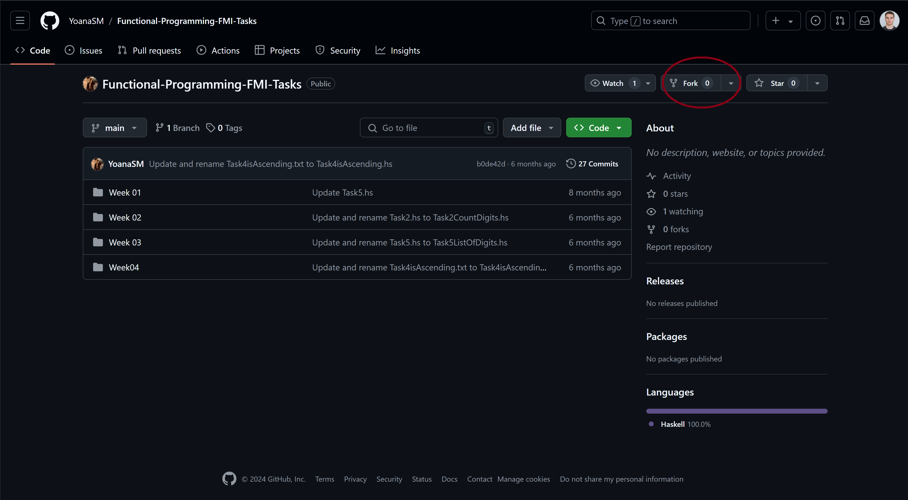
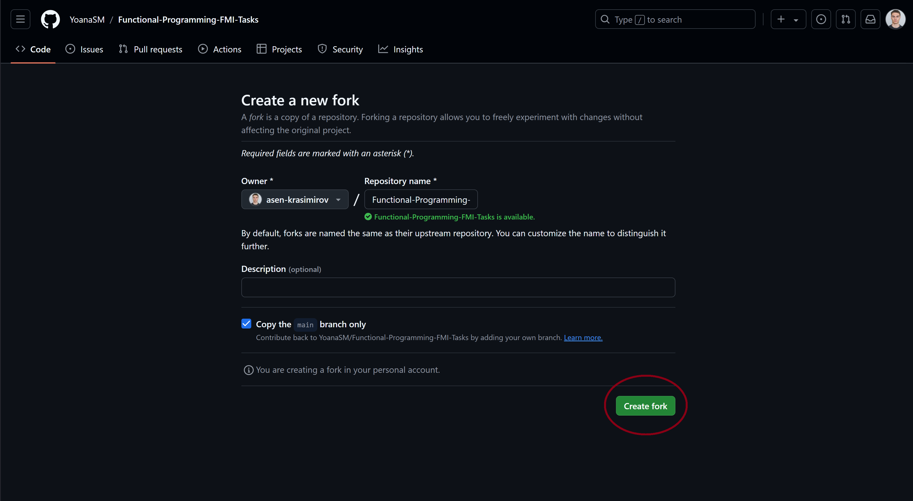
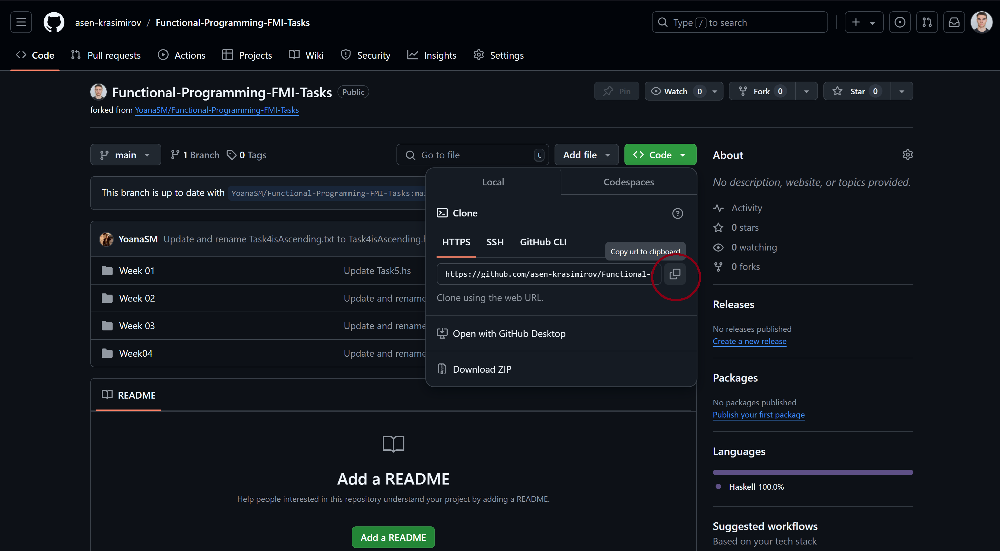
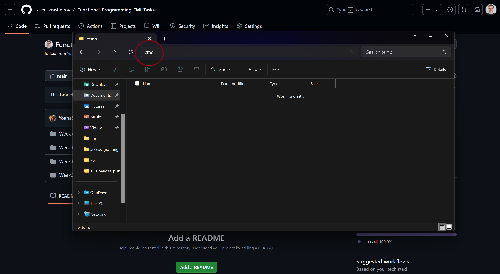
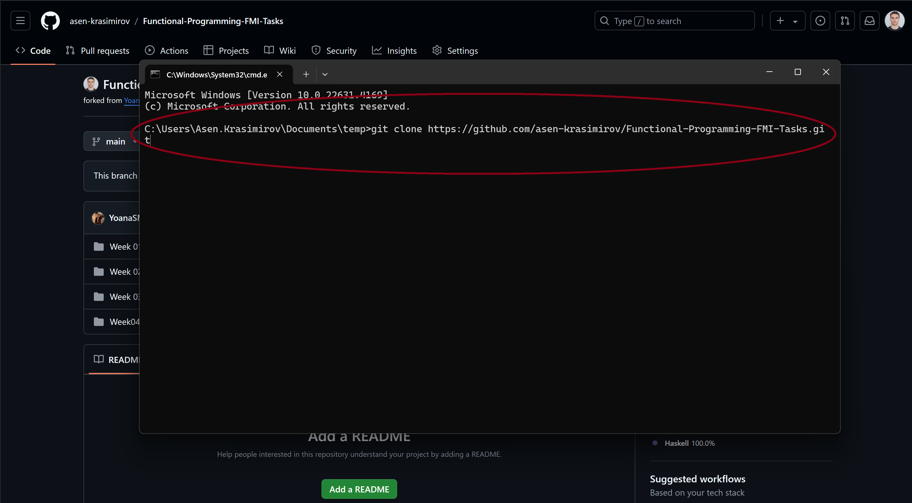
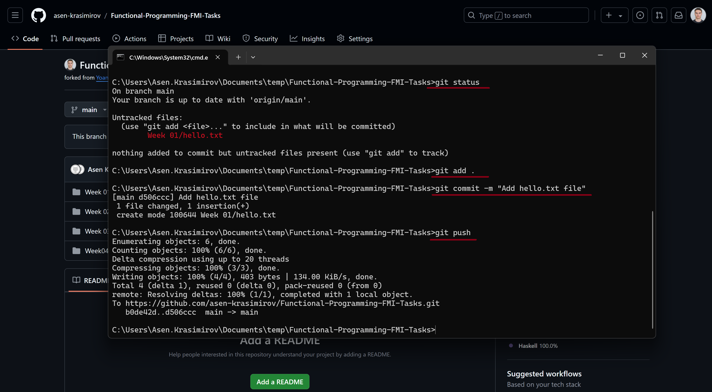
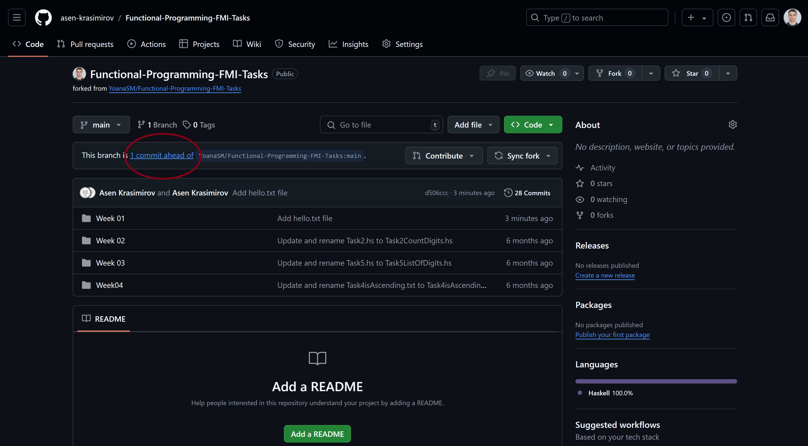
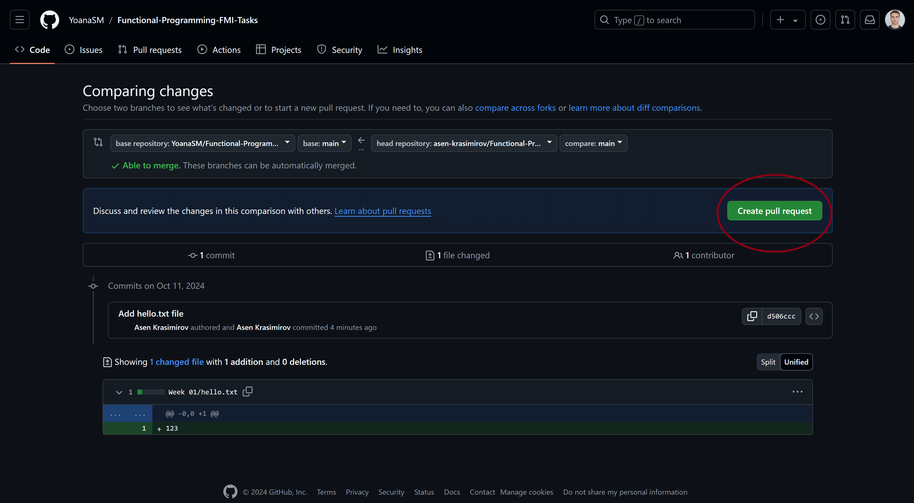

## Github Workflow Simplified

#### 1. Fork   
- 1.1. Отваряте репозиторито в GitHub и натискате Fork.

- 1.2. Създавате fork.

- 1.3. Копирате линка за клониране на fork-а, който създадохте.

- 1.4. Избирате място на локалната си машина, на което искате да съхранявате fork-а, и отваряте Command Prompt-а.

#### 2. Clone
- 2.1. Използвайте командата <b>git clone \<url\></b> за да копирате fork-а на локалната си машина. Където <b>url</b> e линкът, който копирахте в 1.3.

- 2.1. Правите промени по репото като главно ще качвате задачи, които сте решили като ги копирате от лакалната си машните в съответната папка във fork-ът, който току-що клонирахте.

След като направите промени за улеснение може да проверите какво сте проверили с командата <b>git status</b>. След като сте готови с направените промени можете да преминете към избиране по кои файлове да качите промените. Това става с командата <b>git add \<files_to_add\></b> като избирате кои файлове да отбележите за качване. Следва командата <b>git commit -m "\<message\>"</b> (съобщението е задължително), с която финализирате своите промени. Последно пишете командата <b>git push</b>, с която качвате промените.

#### 3. Pull Request
- 3.1 Върнете се на fork-а си в GitHub и следвайте инструкциите:

Важно е да отбележите номера на практикума, на чиито задачи са решенията както и своето име в името на pull request-а. Всичко останало ние можем да коригираме в последствие, за да съвпада със структурата на репозиторито.
